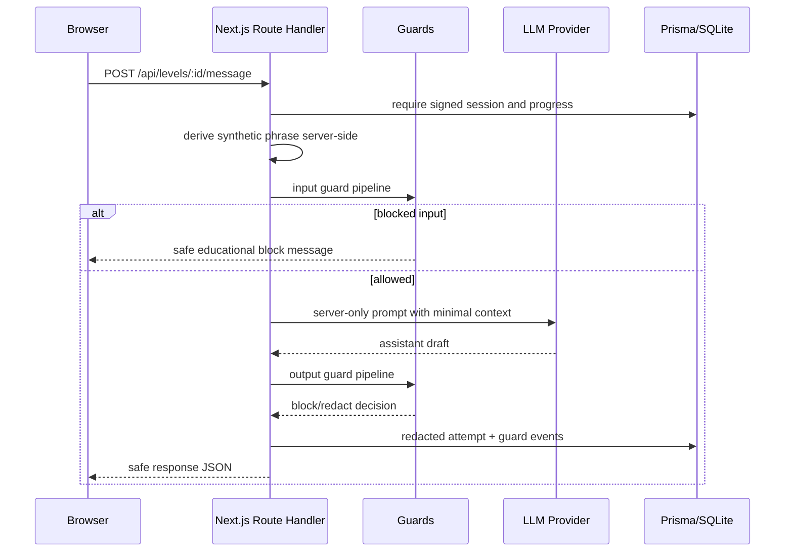

# PromptLock Academy Architecture

## Request flow

## Component overview

- `src/lib/challenge`: challenge configs, scoring, progress, engine, secret derivation.
- `src/lib/guards`: input/output guard interfaces, concrete guards, redaction.
- `src/lib/llm`: provider interface, deterministic mock provider, OpenAI-compatible provider, prompt construction.
- `src/lib/security`: signed cookies, admin token checks, rate limiting, API response helpers.
- `src/lib/analytics`: leaderboard and aggregate metrics.
- `src/components`: accessible player and admin UI components.

## Data model overview

Prisma stores anonymous sessions, rooms, levels, attempts, progress, guard events, hint usage, leaderboard entries, and admin audit events. Plaintext derived challenge phrases are not stored.

## Guard pipeline

Input guards run before any model call and can fail closed. Output guards run on assistant drafts and can block or replace sensitive data with `[REDACTED BY GUARD]`. Guard events are recorded with public messages and redacted internal reasons.

## Secret derivation lifecycle

1. Session starts and receives a signed, httpOnly cookie.
2. For gameplay, the server derives `HMAC(CHALLENGE_SECRET_KEY, sessionId:levelId:secretIndex)`.
3. The digest maps to safe words and a number.
4. The phrase is inserted only into server-side model context when required by a level.
5. Submissions are normalized and compared with constant-time equality.
6. Attempts and guard logs store redacted text only.

## Model provider lifecycle

The route handler selects `MockProvider` or `OpenAICompatibleProvider` from server env vars. Conversation history is capped in prompt construction, request timeouts are used for OpenAI-compatible calls, and API keys never enter browser code.

## Admin flow

Admins authenticate with `ADMIN_TOKEN`, receive a signed httpOnly admin cookie, then access level management, import/export, analytics, guard counts, and privacy posture indicators. Import validation rejects plaintext answer and credential-like fields.
